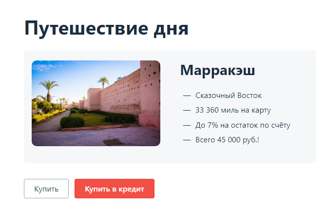

# План автоматизации тестирования веб-сервиса по покупке тура

## Перечень автоматизируемых сценариев

### Предусловия тестов:
1. Открыть сайт ["Путешествие дня"](http://localhost:8080)
2. Выбрать вариант покупки:
     * оплата по дебетовой карте (нажать кнопку "Купить")
     * выдача кредита по данным банковской карты (нажать кнопку "Купить в кредит")

### Проверка API
  - Проверка записи в БД:
    * записывает в БД при валидных данных
    * не записывает в БД при невалидных данных
  - Поддержка MySQL 
  - Поддержка PostgreSQL

### Проверка UI

#### Тестирование формы оплаты картой

##### *Позитивные сценарии:*
* С картой, которая будет одобрена (4444 4444 4444 4441)
* С картой, которая будет отклонена (4444 4444 4444 4442)
* Граничные значения срока действия карты "Год" (максимум 5 лет с текушей даты, например 02.28)
* Граничные значения срока действия карты "Год" (в текущем месяце карта должна быть действительна, например 02.23)
* Граничные значения по длине имени владельца карты (максимум 21 символ, включая пробел)
* Граничные значения по длине имени владельца карты (минимум 2 символа)
* Граничные значения по длине cvc/cvv кода (код должен состоять из трех цифр) 

##### *Негативные сценарии:*
* Случайно сгенерированный номер карты, например: 0123 4567 8901 2345

*Ожидаемый результат:* 

    - сообщение об ошибке: "Ошибка! Банк отказал в проведении операции."

* Дата с истёкшим сроком действия карты, например: 01.2023

*Ожидаемый результат:*

    - поле "Месяц" подсвечено красным с сообщением: "Неверно указан срок действия карты"

* Оставить поле пустым и нажать на кнопку "Продолжить" (проверить все поля по очереди)

*Ожидаемый результат:*

    - для полей: "Номер карты", "Месяц", "Год", "CVC/CVV" - поле подсвечено красным с сообщением: "Неверный формат"
    
    - для поля "Владелец" - поле подсвечено красным с сообщением: "Поле обязательно для заполнения"

* Отправка пустой формы, заполнение полей и повторная отправка

*Ожидаемый результат:*

    - все поля успешно заполнены, сообщений об ошибках нет

* Отправка пустой формы

*Ожидаемый результат:*

    - для полей: "Номер карты", "Месяц", "Год", "CVC/CVV" - поле подсвечено красным с сообщением: "Неверный формат"

    - для поля "Владелец" - поле подсвечено красным с сообщением: "Поле обязательно для заполнения"

* Некорректный месяц, например: "13"

*Ожидаемый результат:*

     - поле "Месяц" подсвечено красным с сообщением: "Неверно указан срок действия карты"

* Месяц со значением "00"

*Ожидаемый результат:*

     - поле "Месяц" подсвечено красным с сообщением: "Неверно указан срок действия карты"

* Граничные значения срока действия карты "Год" (максимум 5 лет), например: 01.2029

*Ожидаемый результат:*

     - поле "Год" подсвечено красным с сообщением: "Неверно указан срок действия карты"

* Граничные значения по длине имени владельца карты (максимум 21 символ, включая пробел), например "Abcdefghijklmnop qrstuvwxyz"

*Ожидаемый результат:*

    - поле "Владелец" подсвечено красным с сообщением: "Поле должно содержать не более 21 символа"

* Граничные значения по длине имени владельца карты (минимум 2 символа), например: "А"

*Ожидаемый результат:*

    - поле "Владелец" подсвечено красным с сообщением: "Поле должно содержать не менее 2 символов"

* Ввод в поле "Владелец" имени на кирилице, например: "Иван Иванов"

*Ожидаемый результат:*

    - поле "Владелец" подсвечено красным с сообщением: "Допускаются только латинские буквы, пробел и дефис"

* Ввод в поле "Владелец" цифр, например: "12345"

*Ожидаемый результат:*

    - поле "Владелец" подсвечено красным с сообщением: "Допускаются только латинские буквы, пробел и дефис"

* Ввод в поле "Владелец" спецсимволов, например "!№;%:?"

*Ожидаемый результат:*

    - поле "Владелец" подсвечено красным с сообщением: "Допускаются только латинские буквы, пробел и дефис"

#### Тестирование формы оплаты в кредит

##### *Позитивные сценарии:*
* С картой, которая будет одобрена (4444 4444 4444 4441)
* С картой, которая будет отклонена (4444 4444 4444 4442)
* Граничные значения срока действия карты "Год" (максимум 5 лет с текушей даты, например: 02.28)
* Граничные значения срока действия карты "Год" (в текущем месяце карта должна быть действительна, например: 02.23)
* Граничные значения по длине имени владельца карты (максимум 21 символ, включая пробел)
* Граничные значения по длине имени владельца карты (минимум 2 символа)
* Оставить пустым поле "Владелец" - кредитные карты бывают без имени
* Граничные значения по длине cvc/cvv кода (код должен состоять из трех цифр)

##### *Негативные сценарии:*
* Случайно сгенерированный номер карты, например: 0123 4567 8901 2345

*Ожидаемый результат:*

    - сообщение об ошибке: "Ошибка! Банк отказал в проведении операции."

* Дата с истёкшим сроком действия карты, например: 01.2023

*Ожидаемый результат:*

    - поле "Месяц" подсвечено красным с сообщением: "Неверно указан срок действия карты"

* Оставить поле пустым и нажать на кнопку "Продолжить" (проверить все поля по очереди)

*Ожидаемый результат:*

    - для полей: "Номер карты", "Месяц", "Год", "CVC/CVV" - поле подсвечено красным с сообщением: "Неверный формат"
    
    - для поля "Владелец" - поле подсвечено красным с сообщением: "Поле обязательно для заполнения"

* Отправка пустой формы

*Ожидаемый результат:*

    - для полей: "Номер карты", "Месяц", "Год", "CVC/CVV" - поле подсвечено красным с сообщением: "Неверный формат"

    - для поля "Владелец" - поле подсвечено красным с сообщением: "Поле обязательно для заполнения"

* Некорректный месяц, например: "13"

*Ожидаемый результат:*

     - поле "Месяц" подсвечено красным с сообщением: "Неверно указан срок действия карты"

* Месяц со значением "00"

*Ожидаемый результат:*

     - поле "Месяц" подсвечено красным с сообщением: "Неверно указан срок действия карты"

* Граничные значения срока действия карты "Год" (максимум 5 лет), например: 01.2029

*Ожидаемый результат:*

     - поле "Год" подсвечено красным с сообщением: "Неверно указан срок действия карты"

* Граничные значения по длине имени владельца карты (максимум 21 символ, включая пробел), например "Abcdefghijklmnop qrstuvwxyz"

*Ожидаемый результат:*

    - поле "Владелец" подсвечено красным с сообщением: "Поле должно содержать не более 21 символа"

* Граничные значения по длине имени владельца карты (минимум 2 символа), например: "А"

*Ожидаемый результат:*

    - поле "Владелец" подсвечено красным с сообщением: "Поле должно содержать не менее 2 символов"

* Ввод в поле "Владелец" имени на кирилице, например: "Иван Иванов"

*Ожидаемый результат:*

    - поле "Владелец" подсвечено красным с сообщением: "Допускаются только латинские буквы, пробел и дефис"

* Ввод в поле "Владелец" цифр, например: "12345"

*Ожидаемый результат:*

    - поле "Владелец" подсвечено красным с сообщением: "Допускаются только латинские буквы, пробел и дефис"

* Ввод в поле "Владелец" спецсимволов, например "!№;%:?"

*Ожидаемый результат:*

    - поле "Владелец" подсвечено красным с сообщением: "Допускаются только латинские буквы, пробел и дефис"

## Перечень используемых инструментов с обоснованием выбора
* **Язык программирования Java** - мощный, высокоуровневый язык программирования, который имеет ряд преимуществ:
    * платформонезависимость
    * безопасность
    * масштабируемость
    * большая экосистема, включающая множество библиотек и инструментов
* **IntelliJ IDEA Community Edition** - профессиональная среда разработки для автотестов на Java
* **Gradle** - производительная система автоматической сборки
* **JUnit 5** - мощный фреймворк для автоматизированного тестирования
* Фреймворк **Selenide** - преимущества:
  * изящный API
  * стабильные тесты
  * мощные селекторы
  * простая конфигурация
* **Faker** - инструмент генерации тестовых данных
* **Lombok** - библиотека java, которая делает код лаконичнее
* **MySQL** - библиотека для работы с БД
* **Postgres** - библиотека для работы с БД
* **Docker** - ПО с поддержкой контейниризации для развёртывания БД в MySQL и PostgreSQL.
* **Git** - система контроля версий позволяющая команде разработчиков и тестировщиков писать, исправлять, дополнять и хранить автотесты
* **GitHub** - платформа для совместной разработки, преимущества:
  - публичные репозитории, комментарии и ветвление
  - хранение истории изменений, возможность вернуться к любой предыдущей версии проекта
  - интеграция с другими инструментами, такими как баг-трекеры, системы контроля версий и другие средства разработки.
* **Appveyor** - система непрерывной интеграции, которая служит для автоматизированной проверки кода, при его загрузке в общий репозиторий.

## Перечень необходимых разрешений, данных и доступов
* Разрешение на автоматизированное тестирование сайта "Путешествие дня"
* Перечень тестовых данных: имя и фамилия держателя карты, номер карты, месяц и год срока действия карты, cvc-код  (для позитивных сценариев)
* Требования к тестовым данным:
  - Имя и фамилия должны состоять из букв на латиннице и должны быть не короче 2 символов 
  - Номер карты в формате: 0123 4567 8901 2345
  - Месяц и год срока действия карты не ранее текущей даты в формате "MM", "YY"
  - cvc/cvv-код в трехзначном формате: "123"
* Пример валидных данных: 4444 4444 4444 4441 / 05.27 / Ivan Ivanov / 123
* Доступы к базам данных: *MySQL* и *PostgreSQL* и API сайта "Путешествие дня"

## Перечень и описание возможных рисков при автоматизации
* Риск некорректной настройки запуска симулятора

* Риск некорректной настройки БД

* Трудности при поиске локаторов элементов на страницах, возможно, что не все имеют явные привязки. В ходе выполнения проекта может измениться структура сайта и локаторы придётся уточнять.

* Увеличение накладных расходов на автоматизацию (возможно данную функциональность дешевле протестировать руками)

* Ошибки в коде: некачественный код или неправильные алгоритмы могут привести к ошибкам в автоматизированных процессах

* Ограниченная гибкость: автоматизированные тесты могут быть ограничены в их возможностях и не могут адаптироваться к изменениям в условиях работы

* Риски производительности: автоматизированные тесты могут занимать много времени на выполнение

## Перечень необходимых специалистов для автоматизации
* AQA Engineer

## Интервальная оценка с учётом рисков в часах
* Настройка и запуск БД и симулятора - 8 часов.
* Написание автотестов - 40 часов
* Подготовка отчетов о проведении тестирования - 12 часов

## План сдачи работ (когда будут авто-тесты, результаты их прогона и отчёт по автоматизации)
* Предоставить план автоматизации дипломному руководителю до 25.02.2023г. включительно

* Разработать автотесты с 26.02.2023г. по 10.03.2023г.

* Получить результат прогона всех автотестов с 11.03.2023г. по 14.03.2023г.

* Создать отчёт по автоматизации с 15.03.2023г. по 18.03.2023г.