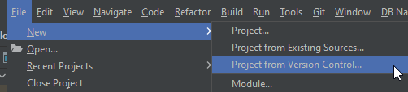
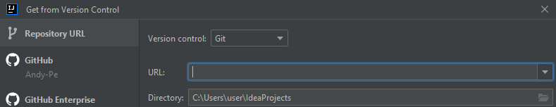

# Дипломный проект по профессии «Тестировщик»

Дипломный проект представляет собой комплексную автоматизацию тестирования веб-сервиса, который взаимодействует с СУБД и API банка.

## Документация

#### [Дипломное задание](https://github.com/netology-code/qa-diploma)

#### [План автоматизации тестирования](https://github.com/Andy-Pe/Diploma-project/blob/main/Documentation/Plan.md)

#### [Отчётные документы по итогам тестирования](https://github.com/Andy-Pe/Diploma-project/blob/main/Documentation/Report.md)

#### [Отчётные документы по итогам автоматизации](https://github.com/Andy-Pe/Diploma-project/blob/main/Documentation/Summary.md)

### Процедура запуска автотестов
1. Для запуска авто-тестов нужно заранее установить и запустить [Docker Desktop](https://github.com/netology-code/aqa-homeworks/blob/master/docker/installation.md) на локальной машине

2. Запустить IntelliJ IDEA 

3. Склонировать репозиторий командой в консоли:
   `git clone https://github.com/Andy-Pe/Diploma-project.git`

   Либо воспользоваться интерфейсом *IntelliJ IDEA:*

В поле `URL` вставить ссылку на репозиторий: `https://github.com/Andy-Pe/Diploma-project.git`

Нажать `Clone`

4. Запустить контейнеры Docker командой в консоли:
>`docker-compose up`

5. Запустить приложение командой в консоли

*для MySQL*:
> `java "-Dspring.datasource.url=jdbc:mysql://localhost:3306/app" "-Dspring.datasource.username=app" "-Dspring.datasource.password=pass" -jar artifacts/aqa-shop.jar`

*для PostgreSQL*:
> `java "-Dspring.datasource.url=jdbc:postgresql://localhost:5432/app" "-Dspring.datasource.username=app" "-Dspring.datasource.password=pass" -jar artifacts/aqa-shop.jar`

6. Запустить авто-тесты командой в консоли

*для MySQL*:
> `./gradlew test "-Ddb.url=jdbc:mysql://localhost:3306/app" "-Ddb.username=app" "-Ddb.password=pass"`

*для PostgreSQL*:
> `./gradlew test "-Ddb.url=jdbc:postgresql://localhost:5432/app" "-Ddb.username=app" "-Ddb.password=pass"`

7. Создание *Allure* отчёта
> `./gradlew allureReport` - формирование отчёта

> `./gradlew allureServe` - отображение отчёта в браузере

8. После выполнения всех тестов и генерации отчета:

- остановить работу приложения командой в консоли:
   `Ctrl+C`
- остановить работу контейнеров Docker командой в консоли:
   `docker-compose down`
